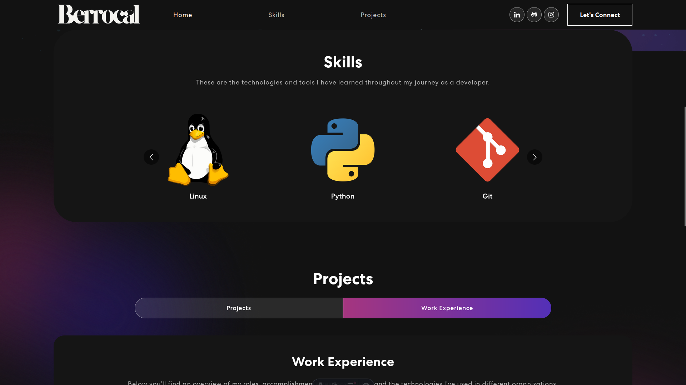
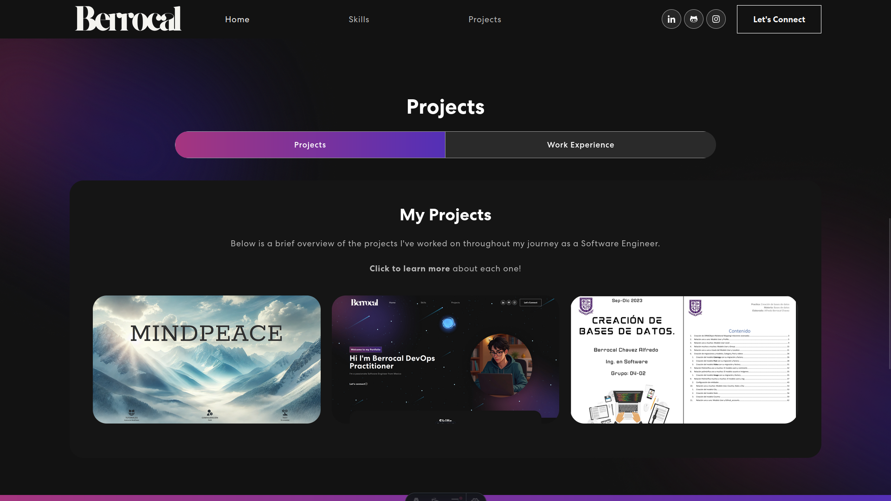
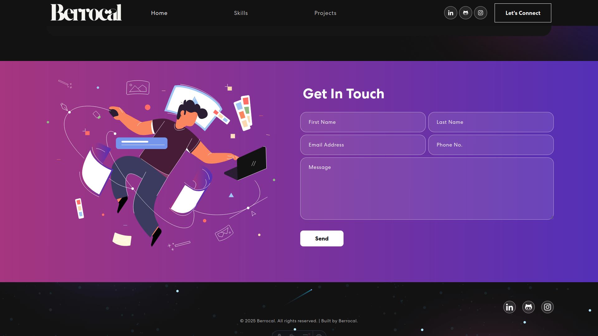

# 🚀 Portafolio Web - Berrocal

Este repositorio contiene el código fuente de mi **portafolio web personal**, diseñado para mostrar mis habilidades, proyectos y experiencia como **Ingeniero de Software**. 

---

## 🌟 Tecnologías Utilizadas

- **Framework Frontend:** React + Astro
- **Estilos:** Tailwind CSS
- **Despliegue:** Vercel
---

## 🎯 Características Principales

- ✔️ **Diseño moderno y responsivo** 🖥️📱
- ✔️ **Sección de habilidades con tecnologías destacadas** 🔧
- ✔️ **Galería de proyectos con capturas y descripciones** 📸
- ✔️ **Formulario de contacto interactivo** ✉️
---

## 📸 Capturas del Proyecto

### ✨ Página Principal

### 🛠️ Sección de Habilidades

### 📂 Portafolio de Proyectos

### 📞 Formulario de Contacto

---

## 🌍 Despliegue
Este portafolio está desplegado en **Vercel**, lo que permite actualizaciones rápidas y un rendimiento óptimo.

🔗 **Visita el sitio en vivo:** [https://tuportafolio.vercel.app](https://tuportafolio.vercel.app)

---

## ⚠️ Aviso Legal
Este portafolio fue desarrollado como un proyecto personal y su código es de libre acceso. Si decides utilizarlo como base para tu propio sitio, no olvides dar crédito. 

Este proyecto toma como base el tutorial de YouTube **"React Project Tutorial: Build a Responsive Portfolio Website w/ Advanced Animations"** de Webdecoded. Puedes ver el video aquí: [https://www.youtube.com/watch?v=hYv6BM2fWd8&t=138s).

💡 **Si te gustó, no dudes en dejar una estrella ⭐ en el repositorio.**

---

¡Gracias por visitar mi portafolio! 😊

